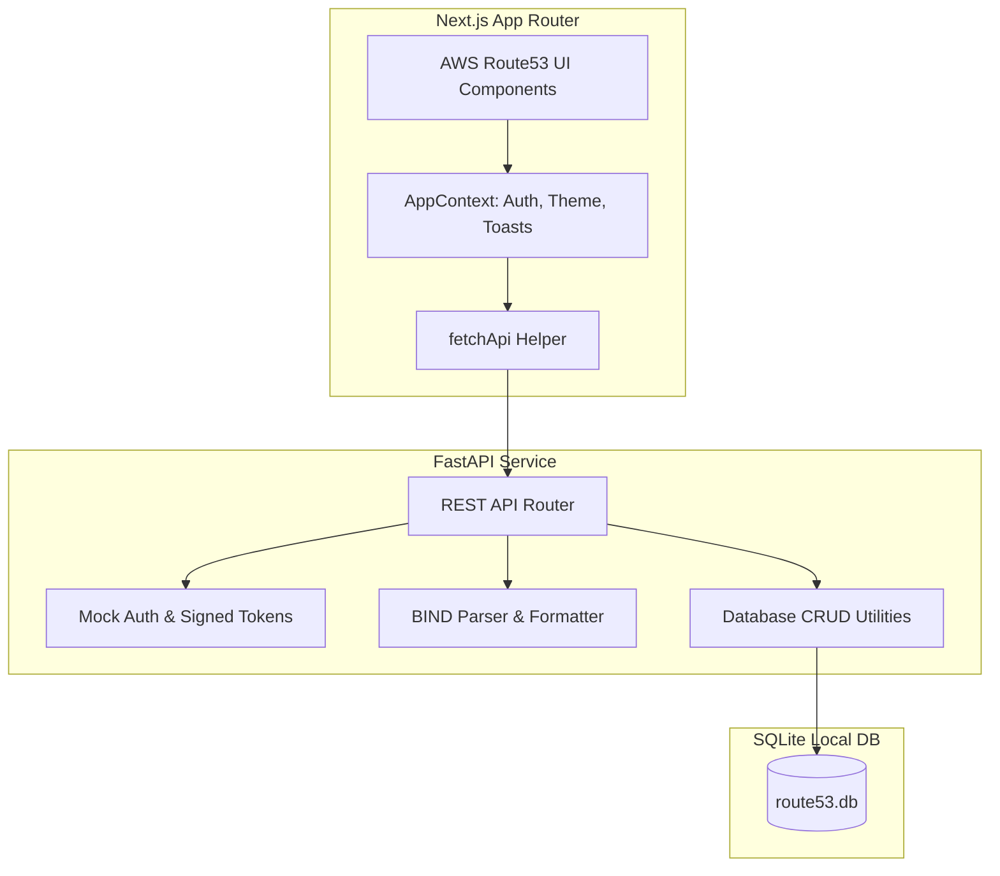

# AWS Route53 Web Console Clone

A functional clone of the Amazon Web Services (AWS) Route53 DNS management console. This application simulates the Route53 user interface, dashboards, and core DNS workflows, backing them with a FastAPI REST API and persistent SQLite database.

## Features

- **Route53 UX Replication**: Clean slate UI styling resembling the AWS Management Console with light and dark theme modes.
- **Authentication**: Stateless, signed-token mock authentication with credentials persistence.
- **Hosted Zones**: Full CRUD (View, Search, Create, Edit, Delete) for Public and Private hosted zones. Creating a zone automatically generates apex **NS** and **SOA** records.
- **DNS Records**: Full CRUD for DNS records (`A`, `AAAA`, `CNAME`, `MX`, `TXT`, `NS`, `PTR`, `SRV`, `CAA`) within a zone, with support for Simple and Weighted routing policies.
- **Alias Records**: Route53 Alias toggles for records, allowing mapping subdomain records directly to other resources.
- **BIND Import & Export**: Import records from standard BIND zone files and export zones as JSON or BIND formats.
- **Keyboard Shortcuts**: Focus the main search bar with `/` and close drawers or modals with `Esc`.
- **Coming Soon Sections**: Simulated placeholders for Dashboard, Traffic Policies, Health Checks, Resolver, and Profiles.

---

## Tech Stack

- **Frontend**: Next.js 15 (React 19, TypeScript, CSS Modules)
- **Backend**: FastAPI (Python 3.14)
- **Database**: SQLite (SQLAlchemy ORM)
- **DNS Utils**: `dnspython` (for zone parsing)

---

## Architecture Overview



---

## Setup Instructions

### Prerequisites
- Node.js (v24 or later)
- Python (3.12 - 3.14)

### 1. Backend Setup
Navigate to the `backend` folder:
```bash
cd backend
```

Create a virtual environment and install packages:
```bash
python -m venv .venv
.venv\Scripts\activate
pip install -r requirements.txt
```

Run the development server:
```bash
uvicorn app.main:app --reload --port 8000
```
The API documentation will be available at [http://localhost:8000/docs](http://localhost:8000/docs).

*Note: On startup, a default administrator account `admin` / `admin` is automatically seeded into the database.*

### 2. Frontend Setup
Navigate to the `frontend` folder:
```bash
cd ../frontend
```

Install dependencies:
```bash
npm install
```

Run the development server:
```bash
npm run dev
```
Open [http://localhost:3000](http://localhost:3000) in your browser.

---

## Database Schema

The SQLite database (`route53.db`) is structured as follows:

### 1. `users`
Tracks administrator login credentials.
- `id` (INTEGER, Primary Key)
- `username` (VARCHAR, Unique, Indexed)
- `password_hash` (VARCHAR)
- `aws_account_id` (VARCHAR) - default: `1234-5678-9012`

### 2. `hosted_zones`
Contains containers for DNS records.
- `id` (VARCHAR, Primary Key) - format: `Z[A-Z0-9]{13}`
- `name` (VARCHAR) - normalized domain name (e.g. `example.com.`)
- `description` (VARCHAR, Nullable)
- `type` (VARCHAR) - `Public` or `Private`
- `vpc_id` (VARCHAR, Nullable) - e.g. `vpc-0123456...`
- `vpc_region` (VARCHAR, Nullable)
- `record_count` (INTEGER) - default: 2 (starts with apex NS & SOA)
- `created_at` (TIMESTAMP)

### 3. `dns_records`
Holds specific DNS resource entries within a hosted zone.
- `id` (VARCHAR, Primary Key) - format: `R[A-Z0-9]{13}`
- `hosted_zone_id` (VARCHAR, Foreign Key to `hosted_zones.id`)
- `name` (VARCHAR) - normalized subdomain (e.g. `www.example.com.`)
- `type` (VARCHAR) - e.g., `A`, `CNAME`, `MX`
- `routing_policy` (VARCHAR) - `Simple` or `Weighted`
- `ttl` (INTEGER) - cache expiry time in seconds
- `value` (TEXT) - newline-separated value list
- `weight` (INTEGER, Nullable) - for Weighted records
- `set_id` (VARCHAR, Nullable) - weight/failover identifier
- `alias` (BOOLEAN) - whether the record routes to an AWS resource
- `alias_target` (VARCHAR, Nullable) - Route53 Alias destination
- `health_check_id` (VARCHAR, Nullable)
- `created_at` (TIMESTAMP)

---

## API Overview

### Authentication
- `POST /api/auth/login`: Authenticates administrator. Sets a HTTPOnly session cookie.
- `POST /api/auth/logout`: Invalidates session cookie.
- `GET /api/auth/me`: Retrieves current session profile.

### Hosted Zones
- `GET /api/hosted-zones`: List hosted zones (supports keyword `query` filter).
- `POST /api/hosted-zones`: Create new zone (creates default apex NS & SOA records).
- `GET /api/hosted-zones/{id}`: Fetch detailed zone metadata.
- `PUT /api/hosted-zones/{id}`: Modify hosted zone description.
- `DELETE /api/hosted-zones/{id}`: Remove zone and cascading records.

### DNS Records
- `GET /api/hosted-zones/{zone_id}/records`: Retrieve records matching query or type.
- `POST /api/hosted-zones/{zone_id}/records`: Add a new DNS entry. Normalizes subdomain inputs.
- `PUT /api/hosted-zones/{zone_id}/records/{rec_id}`: Edit record TTL, policy, and values.
- `DELETE /api/hosted-zones/{zone_id}/records/{rec_id}`: Remove record (excludes apex NS/SOA).
- `POST /api/hosted-zones/{zone_id}/records/bulk-delete`: Bulk delete selected records.

### BIND Import & Export
- `POST /api/hosted-zones/{zone_id}/import/bind`: Accept and parse BIND zone file uploads, adding records to the database.
- `GET /api/hosted-zones/{zone_id}/export`: Download zone records in BIND format or JSON.
